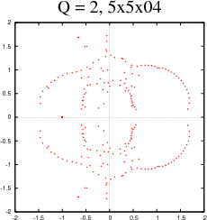
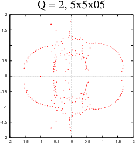
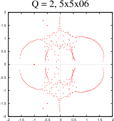
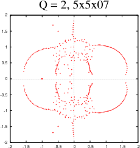
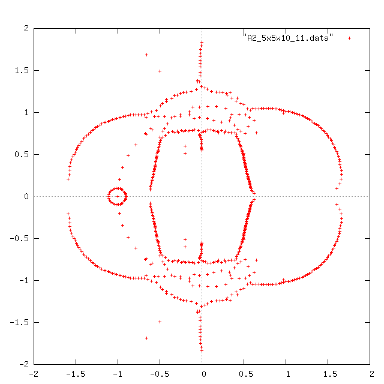
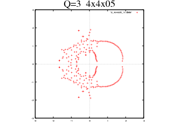
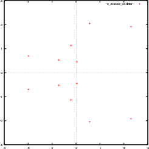
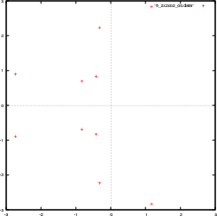

**Table of Contents**
{: #toc }
*  TOC
{:toc}

<!-- /.medium-4.columns -->

## Pearson's Results {#pearsons}
In 1991 Pearson, calculated the exact partition function for the
<strong>4</strong>x<strong>4</strong>x<strong>4</strong>
Ising model. Plotting Pearson's results against my own. I also managed to calculate this using my program, the results are compared

### Pearson vs. Yogi  {#pearsonvsyogi}
This page displays my results against R.B Pearsons.

<figure>

<figcaption>
Fig 1:Zero's of Pearsons
<strong>4</strong>x<strong>4</strong>x<strong>4</strong>
periodic boundary conditions in all directions
</figcaption>
</figure>

<figure>

<figcaption>
Fig 2:I have added my zero's of a
<strong>4</strong>x<strong>4</strong>x4
with periodic boundary conditions in only 2 directions
</figcaption>
</figure>

<figure>

<figcaption>
Fig 3: I have added my zero's of a
<strong>4</strong>x<strong>4</strong>x10
with periodic boundary conditions in only 2 directions
</figcaption>
</figure>

## Zero Distribution of 5x5x10 {#zeros5x5x10}
<figure>

<figcaption>
Fig 1: Zero distribution of 2 state
<strong>5</strong>x<strong>5</strong>x10
. Potts Model with periodic boundary conditions in the shorter dimensions 
</figcaption>
</figure>

## Animation of 5x5xN (where 2 &lt;= N &lt;= 10) {#animation5x5xN}
<figure>

<figcaption>
Fig 1: Zero distribution of 2 state
<strong>5</strong>x<strong>5</strong>x10
. Potts Model with periodic boundary conditions in the shorter dimensions 
</figcaption>
</figure>

## Zero distribution for Q=2 5x5xN {#stills5x5xN}

---|---
 | 
 | 
 | 
 | 
 | 

A study of the boundary conditions. The left column of results are my
original ones. The right column is trivial palindromes of the polynomials found.

---|---
|
|
|
|
|
|
|
|
|

</a>

## Zeros of 3 State 4x4x10 Potts Model {#threestate4x4x10}

Fig 1: Periodic boundary conditions in the two short direction

## 3 state animation of 4x4xN (where 2 &lt;= N &lt;= 10) {#anitmation3state4x4x10}

## Zero distribution for Q=3 4x4xN {#stills3state4x4x10}

---|---
|
|
|
|
|

A study of the boundary conditions. The left column of results are my
original ones. The right column is trivial palindromes of the polynomials found.

---|---
|
|
|
|
|
|
|
|
|

### Animation of the 3 state 4x4xN

## Zero Distribution of 4 state Potts Models {#fourstate}

Below are zero distributions for the 3 x 4 x 10 Potts lattice model with Q = 4. This is for the purpose of taking a closer look at boundary conditions. The dimesions are height x width x depth 

---|---
|
Fig 1: No Boundary conditions|Fig 2: Periodic Boundary conditions in dimesions along the width and height
|
Fig 3: Periodic Boundary conditions in dimensions along the width only.|Fig 4: Periodic Boundary conditions in dimensions along the height only.

## Zero Distribution of 5 state Potts Models {#fivestate}
Below are zero distributions for the 3 x 3 x 10 Potts lattice model with Q = 5. This is for the purpose of taking a closer look at boundary conditions. The dimesions are height x width x depth

---|---
|
Fig 1: No Boundary conditions|Fig 2: Periodic Boundary conditions in dimesions along the width and height&nbsp;
|
Fig 3: Periodic Boundary conditions in dimensions along the width only.|Fig 4: Periodic Boundary conditions in dimensions along the height only.

## The zero's of my largest 3 dimensional results. {#large3dresults}
### 2-state 4x6x10 lattice

### 2-state 5x5x10 lattice (anti-ferromagnetic on right)
&nbsp;  &nbsp; 
### 2-state 4x4x10 lattice, with period boundary conditions

## A closer look at the zero's pinching the real axis
On this page we take a closer look at the "pinch" of the two outer arms of zeros on the real axis. A plot of the anti-ferromagnetic zeros of a 5x5x10 lattice with q=2 is shown below.
The parametric graph f(x(t), y(t)) = a*cos(t)(1+cos(t+k)) + b, c*sin(t)(1+cos(t+k))+d is also plotted.
Where a, b, c, d and k are real value constants.
 
  

The figure below is a closer look at the top right arm. 

## Specific Heat

<a href="q2animation.html">Q = 2</a>

## Animation of Potts model with Q = 2

Below are animations of all the 2 state zero distributions found.

---|---
|
Animation 1: No boundary conditions|Animation 2: Boundary condition in both directions
|
Animation 3: Boundary Conditions only connecting the rows|Animation 4: Boundary Conditions only connecting the columns

## Animation of Potts model with Q = 3

## Animation of Potts model with Q = 4

## Animation of Potts model with Q = 5

## Animation of Potts model with Q = 6

## 2D Results
<ul >
<li>6 state: <a href="images/2Dzeros/6-01x08x08-010.gif">8x8</a>, <a href="images/2Dzeros/6-01x07x07-011.gif">7x7</a> (periodic boundary conditions)</li>
<li>3 state:<a href="images/2Dzeros/3-01x12x16-010.gif">12x16</a></li>
</ul>

<!-- /.medium-8.columns -->

<!-- /.row -->
